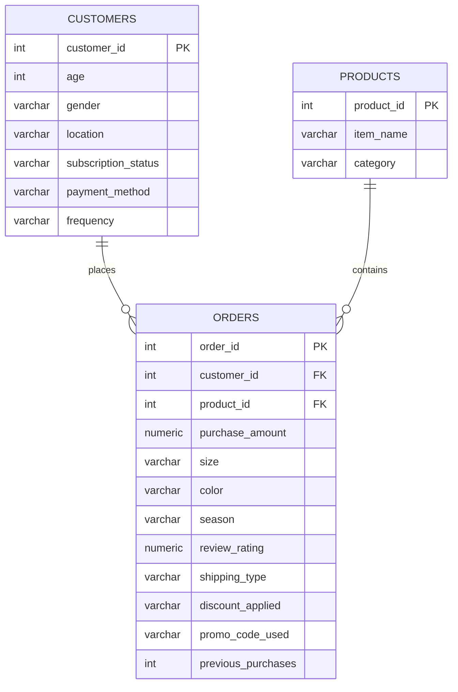

# Customer Shopping Behavior Analysis

Analyzed 3,900 customer shopping records to understand purchasing patterns, identify high-value customer segments, and find what drives repeat purchases. Built using Python, PostgreSQL, and Power BI.

---

## Background

A retail company wants to better understand its customers — who's spending the most, whether discounts actually help, what makes customers come back, and how shopping behavior shifts across seasons and demographics. This project tackles those questions through exploratory analysis, SQL queries on a normalized database, and an interactive dashboard.

---

## Tools Used

| Layer | Tool | What I used it for |
|-------|------|--------------------|
| Data Cleaning & EDA | Python (Pandas) | Handling nulls, fixing data types, feature engineering |
| Database | PostgreSQL | Designed a normalized schema, wrote analytical queries |
| Python-to-DB Pipeline | SQLAlchemy, psycopg2 | Automated loading from CSV into PostgreSQL |
| Dashboard | Power BI | Built an interactive dashboard with slicers and KPIs |
| Presentation | PowerPoint | Summarized findings for a business audience |

---

## Project Structure

```
Customer_trends/
│
├── customer_shopping_behavior.csv            # Raw dataset (3,900 records, 18 columns)
├── Customer_Shopping_Behavior_Analysis.ipynb  # Python EDA + data pipeline to PostgreSQL
├── customer_behavior_sql_queries.sql          # 15 SQL queries (schema + analytics)
├── customer_behavior_dashboard.pbix          # Power BI interactive dashboard
├── Customer-Shopping-Behavior-Analysis.pptx  # Presentation with key findings
├── Business Problem Document.pdf             # Problem statement
└── README.md
```

---

## Database Schema

The original dataset is a single flat CSV. I normalized it into 3 tables to practice relational design and write proper JOINs.



---

## SQL Queries Overview

The SQL file has 15 queries split into three sections:

**Schema Design** — Table creation with primary/foreign keys, normalizing the flat CSV into the 3 tables shown above.

**Core Analytics (Q1–Q10)**

| Query | Question | What it demonstrates |
|-------|----------|----------------------|
| Q1 | Revenue by gender | JOIN, GROUP BY, SUM, AVG |
| Q2 | High-spenders who used discounts | Subquery in WHERE clause |
| Q3 | Top-rated products (min 10 reviews) | HAVING, JOIN |
| Q4 | Spend comparison across shipping types | STDDEV, GROUP BY |
| Q5 | Do subscribers spend more? | COUNT(DISTINCT), multi-aggregate |
| Q6 | Products with highest discount usage | CASE WHEN, percentage calc |
| Q7 | Customer segmentation (New/Returning/Loyal) | CTE, CASE WHEN derived buckets |
| Q8 | Top 3 products per category | ROW_NUMBER, PARTITION BY |
| Q9 | Do repeat buyers subscribe more? | SUM() OVER() for pct of total |
| Q10 | Revenue by age group | Derived age buckets with CASE WHEN |

**Advanced Analytics (Q11–Q15)**

| Query | Question | What it demonstrates |
|-------|----------|----------------------|
| Q11 | Best-performing season per category | DENSE_RANK, multi-level grouping |
| Q12 | Cumulative revenue by age group | Running totals with SUM() OVER(ORDER BY) |
| Q13 | Top 25% customers by spend | NTILE(4) quartile analysis |
| Q14 | Payment method preference by gender | Cross-tab, COALESCE, NULLIF |
| Q15 | Top 10 locations by revenue | HAVING, COUNT(DISTINCT), multi-aggregate |

---

## What I Found

- Male and female customers bring in roughly equal revenue but lean toward different product categories.
- A good chunk of customers who use discounts still spend above the overall average — discounts don't necessarily mean low-value customers.
- Subscribers have a noticeably higher average order value, which makes a case for investing in retention.
- The "Loyal" segment (10+ previous purchases) punches above its weight in total revenue contribution.
- Categories show clear seasonal peaks — useful for planning inventory and running targeted promotions.

---

## How to Run This

**Python Notebook**
```bash
pip install pandas sqlalchemy psycopg2-binary
jupyter notebook Customer_Shopping_Behavior_Analysis.ipynb
```

**SQL Queries**
1. Set up a PostgreSQL database
2. Load the CSV into a `customer_raw` staging table
3. Run the schema creation queries (Part 1) to build the normalized tables
4. Run the analytical queries (Parts 2 and 3)

**Power BI**
Open `customer_behavior_dashboard.pbix` in Power BI Desktop.

---

Built as a portfolio project to demonstrate skills in data analysis, SQL, and business intelligence.
